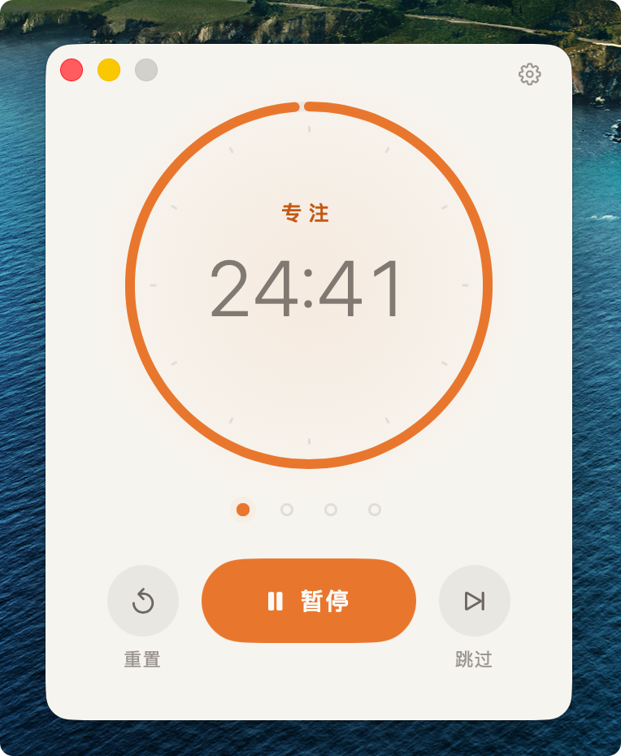
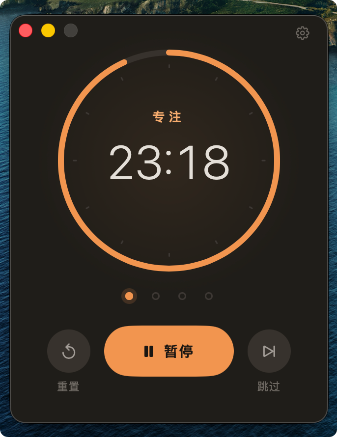
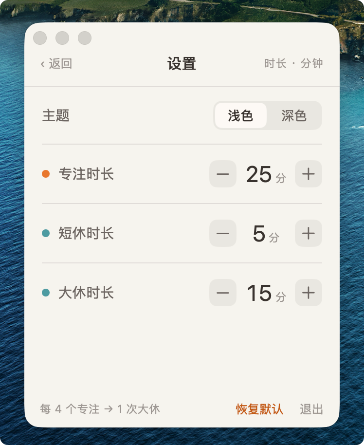
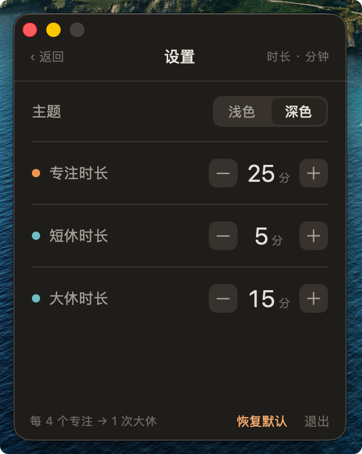

# Poco

一个常驻 macOS 菜单栏的极简番茄钟。

> 菜单栏倒计时是"甜点"，主窗口是"主菜"——两者实时同步同一个计时源。

---

## 截图

<table>
  <tr>
    <td align="center"><b>菜单栏 · 未运行</b></td>
    <td align="center"><b>菜单栏 · 运行中</b></td>
  </tr>
  <tr>
    <td></td>
    <td></td>
  </tr>
</table>

<table>
  <tr>
    <td align="center"><b>主窗口 · 浅色</b></td>
    <td align="center"><b>主窗口 · 深色</b></td>
  </tr>
  <tr>
    <td></td>
    <td></td>
  </tr>
</table>

<table>
  <tr>
    <td align="center"><b>设置 · 浅色</b></td>
    <td align="center"><b>设置 · 深色</b></td>
  </tr>
  <tr>
    <td></td>
    <td></td>
  </tr>
</table>

---

## 功能

- **菜单栏常驻**：未运行时显示番茄图标，运行时显示 `MM:SS` 倒计时，暂停时显示 `⏸ MM:SS`
- **双击菜单栏**唤出主窗口（单击不响应，避免误触）；右键弹出快捷操作菜单
- **进度环**：满环 → 运行消减 → 结束归零，配合呼吸动画
- **4 颗圆点**实时标示当前处于本组第几个专注轮
- **浅/深双主题**手动切换，不跟随系统
- **阶段结束系统通知** + Dock 图标跳动提醒
- **手动推进**：倒计时归零后不自动进入下一阶段，等用户点「开始」
- **关窗隐藏不退出**，常驻菜单栏

## 番茄钟规则

| 阶段 | 默认时长 | 可配置范围 |
|------|---------|-----------|
| 专注 | 25 分钟  | 1–60 分钟 |
| 短休 | 5 分钟   | 1–60 分钟 |
| 大休 | 15 分钟  | 1–60 分钟 |

每完成 **4 个专注** → 1 次**大休** → 计数归零循环。每组固定 4 轮。

```
专注 → 短休 → 专注 → 短休 → 专注 → 短休 → 专注 → 大休 → （循环）
  1           2           3           4
```

**跳过不计数**：只有自然走完的专注才 +1，手动跳过不触发大休也不发通知。

## 技术栈

- **语言**：Swift 5，仅 macOS，最低系统 macOS 14
- **UI**：SwiftUI（主窗口）+ AppKit（菜单栏 `NSStatusItem`、窗口生命周期）
- **通知**：`UNUserNotificationCenter`
- **持久化**：`UserDefaults`（三时长 + 主题，不持久化计时进度）
- **计时**：以墙钟结束时刻为准，250ms tick 仅刷新显示，避免睡眠漂移

## 构建与运行

需要 Xcode 15+，macOS 14+。

```bash
cd src/macOS

# 构建
xcodebuild -project Poco.xcodeproj -scheme Poco -configuration Debug build

# 运行单测
xcodebuild -project Poco.xcodeproj -scheme Poco test

# 运行（构建后）
open ~/Library/Developer/Xcode/DerivedData/Poco-*/Build/Products/Debug/Poco.app
```

也可直接用 Xcode 打开 `src/macOS/Poco.xcodeproj`，⌘R 运行，⌘U 跑测试。

> **Debug 模式使用秒级时长**（专注 10s / 短休 5s / 大休 8s），方便快速验证流程。真实时长用 Release 配置。

## 项目结构

```
src/macOS/
  Poco.xcodeproj/
  Poco/
    main.swift                          # AppKit 入口
    AppDelegate.swift                   # 窗口管理、托盘/通知挂载
    PomodoroEngine.swift                # 单一计时源（状态机 + 墙钟计时 + 设置读写）
    Models/
      PocoModels.swift                  # PocoPhase / TimerState 枚举
      PomodoroLogic.swift               # 阶段推进纯函数
      TrayTextFormat.swift              # 状态 → 菜单栏文本映射
      SettingsStore.swift               # UserDefaults 持久化
    Views/
      Theme.swift                       # 双主题色板 + 自定义 ButtonStyle
      MainView.swift                    # 进度环 + 呼吸动画 + 控制区
      SettingsView.swift                # 主题切换 + 时长步进 + 恢复默认
    Tray/
      StatusItemController.swift        # NSStatusItem：图标⇄倒计时文本
    Notify/
      NotificationManager.swift         # 阶段结束通知
  PocoTests/                            # Swift Testing 单元测试
```

## License

MIT
